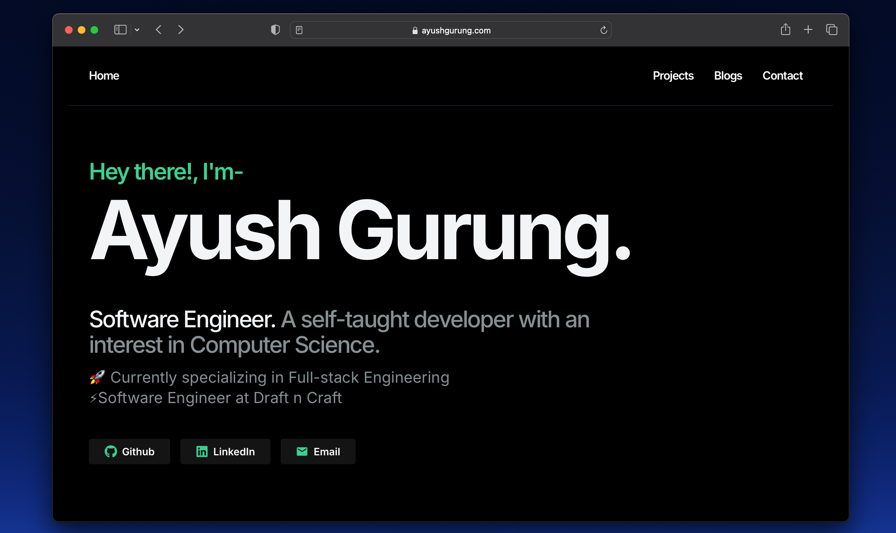

# Ayush Gurung – Software Engineer Portfolio

> A minimal, high-performance developer portfolio built with Next.js App Router, showcasing personal projects, technical blogs, and contact interface – designed for clarity, speed, and authenticity.




**Live Site** → [ayushgurung.com](https://ayushgurung.com)

---

## 🚀 Tech Stack

- **Framework:** [Next.js 15 (App Router)](https://nextjs.org/)
- **Styling:** TailwindCSS + Framer Motion
- **Data Layer:** Supabase (PostgreSQL) + API Routes
- **Caching Strategy:** ISR (Incremental Static Regeneration) + SWR for client hydration
- **Email & Forms:** Supabase + Resend + CAPTCHA
- **Markdown CMS:** GitHub Issues-based blog system

---

## 📁 Features

- **Projects & Blogs with Slugs:** Fully SEO-optimized pages generated per slug using dynamic routing and static caching.
- **Unified Data Fetching:** Centralized data helper functions power both ISR and SWR for DRY and maintainable logic.
- **Blog System via GitHub Issues:** Write once, publish everywhere — zero CMS overhead.
- **Instant Navigation UX:** Prehydrated layouts and cached SWR responses create fast, no-jitter transitions.
- **Contact Form:** Spam-protected contact pop-up with Supabase integration and Resend email notifications.
- **Dynamic Table of Contents:** On long pages like blog/projects, a live ToC improves reading/navigation flow.
- **Production-grade Setup:** Deploy-ready and structured for growth, not just aesthetics.

---

## 🧪 Running Locally

```bash
git clone https://github.com/ayushgurung18/portfolio.git
cd portfolio
npm install
cp .env.example .env.local  # Add Supabase + Resend keys
npm run dev
```

# Folder Structure
.
├── app/                # Next.js App Router pages
├── components/         # UI components
├── lib/                # Reusable helpers (SWR, metadata, fetchers)
├── public/             # Static assets
├── styles/             # Global styles and animations
└── supabase/           # DB structure, config (optional)


# Contact
> Feel free to reach out via:

- **Email**: ayushgurung18sep@gmail.com

- **LinkedIn**: linkedin.com/in/ayushgurung

- **Twitter**: @ayushgurung18